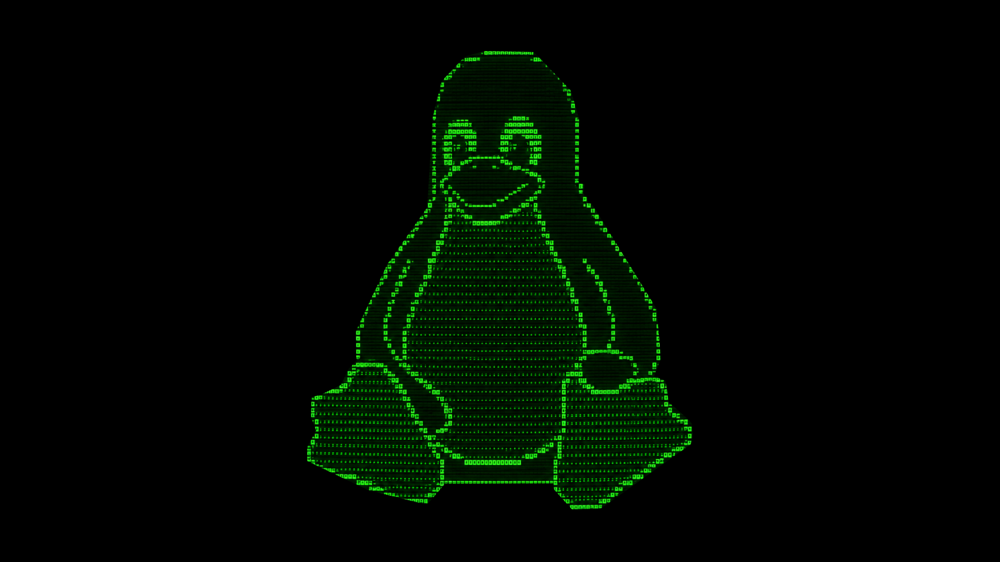

# Terminux

**A modern, customizable terminal for developers, power users, and remote workflows.**

Terminux is a GPU-accelerated terminal emulator and workspace manager built on top of the open-source **WezTerm** project. It combines high-performance rendering with advanced session management, a plugin system, customizable themes, and a streamlined developer-focused experience.



---

## Features

### Modern terminal experience

* GPU-accelerated rendering
* Tabs and split panes
* Smooth scrolling and high-performance text rendering
* Unicode and emoji support
* Configurable keyboard shortcuts

### Workspace & session management

* Automatic session persistence
* Restore tabs, panes, and working directories
* Workspace snapshots
* Crash recovery support
* Export/import session files

### Command palette

* Fuzzy command search (`Ctrl+Shift+P`)
* Workspace switching
* Instant theme switching
* SSH quick-connect support
* Reload configuration without restarting

### Plugin system

* Lua-based plugin API
* Hot-reload support
* Custom commands and keybindings
* Plugin lifecycle hooks
* Example plugins included

### Built-in themes

* **Terminux Dark** (default)
* **Terminux Light**
* **Midnight**
* **Neon**

---

## Installation

### AppImage (recommended)

Download the latest AppImage from the Releases page and run:

```bash
chmod +x Terminux-1.0.0-x86_64.AppImage
./Terminux-1.0.0-x86_64.AppImage
```

### Debian / Ubuntu / Linux Mint

```bash
sudo dpkg -i terminux_1.0.0_amd64.deb
sudo apt -f install
```

### Verify installation

```bash
terminux --version
```

Expected output:

```text
Terminux 1.0.0
Based on WezTerm
Renderer: GPU
```

---

## Quick Start

### Open the command palette

```text
Ctrl + Shift + P
```

### Split panes

```text
Alt + Shift + -   # Horizontal split
Alt + Shift + |   # Vertical split
```

### Switch themes instantly

```bash
terminux theme dark
terminux theme light
terminux theme neon
```

---

## Configuration

Terminux stores its configuration in:

```text
~/.config/terminux/config.lua
```

Example configuration:

```lua
return {
  theme = "terminux-dark",
  font = "JetBrains Mono",
  font_size = 14,
  opacity = 0.95,
  enable_dashboard = true,
}
```

Reload the configuration from the command palette:

```text
> Reload Configuration
```

---

## Plugins

Plugins are stored in:

```text
~/.config/terminux/plugins/
```

Example structure:

```text
plugins/
└── hello_terminux/
    ├── manifest.json
    ├── plugin.lua
    └── README.md
```

Example `plugin.lua`:

```lua
function on_load()
  terminux.notify("Hello Terminux loaded!")
end

terminux.register_command({
  name = "hello-terminux",
  description = "Display a greeting",
  callback = function()
    terminux.notify("Hello from the plugin system!")
  end
})
```

Useful plugin commands:

```bash
terminux plugin list
terminux plugin reload
terminux plugin enable hello_terminux
terminux plugin disable hello_terminux
```

---

## Sessions & Workspaces

Session files are stored in:

```text
~/.config/terminux/sessions/
```

Save the current workspace:

```text
> Save Workspace: webapp
```

Restore the last session:

```text
> Restore Last Session
```

Export a session:

```bash
terminux session export mysession.json
```

Import a session:

```bash
terminux session import mysession.json
```

---

## SSH Profiles

Create `~/.config/terminux/ssh_profiles.lua`:

```lua
return {
  {
    name = "Production",
    host = "prod.example.com",
    user = "ubuntu",
    port = 22,
  },
}
```

Then open the command palette:

```text
> Connect: Production
```

Passwords are **never stored** by Terminux.

---

## Building from Source

### Install dependencies (Linux Mint / Ubuntu)

```bash
sudo apt update
sudo apt install -y \
  build-essential cmake pkg-config curl git \
  libx11-dev libxkbcommon-dev libwayland-dev \
  libegl1-mesa-dev libfontconfig1-dev libfreetype6-dev \
  libasound2-dev
```

### Install Rust

```bash
curl https://sh.rustup.rs -sSf | sh
```

### Clone and build

```bash
git clone --recursive https://github.com/<your-username>/terminux.git
cd terminux
cargo build --release
```

### Run

```bash
./target/release/terminux
```

---

## Default Keyboard Shortcuts

| Action               | Shortcut       |   |
| -------------------- | -------------- | - |
| Command palette      | `Ctrl+Shift+P` |   |
| New tab              | `Ctrl+Shift+T` |   |
| Close tab            | `Ctrl+Shift+W` |   |
| Horizontal split     | `Alt+Shift+-`  |   |
| Vertical split       | `Alt+Shift+    | ` |
| Increase font size   | `Ctrl++`       |   |
| Decrease font size   | `Ctrl+-`       |   |
| Reset font size      | `Ctrl+0`       |   |
| Reload configuration | `Ctrl+Shift+R` |   |

---

## Roadmap (v1.1)

* Enhanced plugin sandboxing
* Additional built-in themes
* Dashboard customization
* Remote workspace synchronization
* Performance profiling tools
* Optional background blur and visual effects
* Windows packaging support
* macOS packaging support

---

## Acknowledgements

Terminux is based on the excellent **WezTerm** project.

* WezTerm: https://github.com/wezterm/wezterm

Huge thanks to the WezTerm contributors and the broader open-source terminal community for their work and inspiration.

---

## License

Terminux includes code from **WezTerm**, which is licensed under the MIT License. See the `LICENSE` file for details.

Additional Terminux-specific code is released under the same license unless otherwise noted.

---

## Contributing

Contributions are welcome!

* Open an issue to report bugs or request features
* Submit pull requests for fixes and improvements
* Share themes and plugins with the community

---

## Support

* GitHub Issues: `https://github.com/<your-username>/terminux/issues`
* Discussions: `https://github.com/<your-username>/terminux/discussions`

If you find Terminux useful, consider starring the repository and sharing it with other developers.

---

<div align="center">

### **Terminux 1.0.0**

Modern terminal • Persistent workspaces • Plugin powered • Built with Rust

</div>
